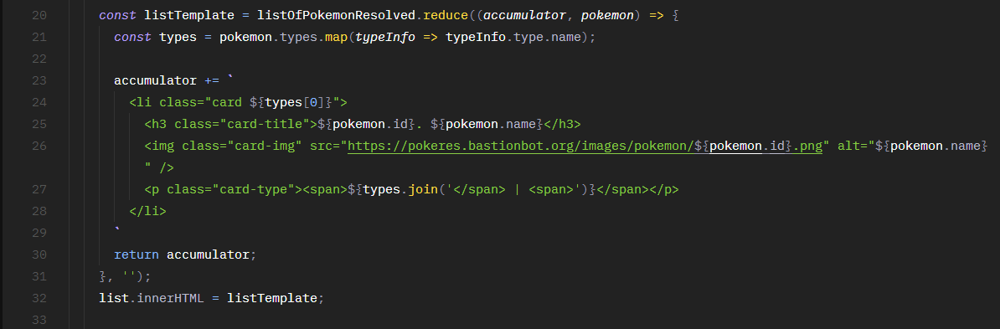

# Projeto Pokedex dos primeiros 150 pokemon

Esse é um projeto desenvolvido para mostrar os primeiros 150 pokemon do anime Pokemon. O projeto além de mostrar os pokemon em forma de cards, ainda apresenta seus tipos e descrições.

## Filtragem por diferentes tipos de pokemon

_**Utilizando o método do construtor de Arrays chamado filter, foi possível criar uma solução elegante para filtrar os pokemon de acordo com seus tipos**_ (fire, water, poison, etc...). Dessa forma o usuário será capaz procurar por pokemon de tipos especificos, e de acordo com a sua necessidade. Esse método retorna um novo array contendo os elemento que retornaram "true" para a pesquisa.

## Filtragem por nome

_**Também é possivel realizar uma filtragem de acordo com o nome de um pokemon específico**_. Essa estratégia é realizada por meio do uso do método do construtor de Arrays conhecido como find. Esse método é utilizado para situações em que queremos retornar um item em particular que encontra-se dentro de um array de dados.

## Médoto de arrays "Reduce"

_**Com o auxilio do método do construtor de Arrays conhecido como reduce, todos os cards dos pokemon desse projeto são criados automaticamente e também dinâmicamente**_, de acordo com a quantidade de pokemon gerada no site.

Para mais informações, olhar o arquivo fetchPokemon.js em scripts/modules.

## Web Speech API

_**A parte mais divertida desse projeto com certeza é a implementação da Web Speec API no mesmo. Adicionando essa funcionalidade ao projeto, foi possível simular o recurso de fala de uma pokedex da mesma forma que ocorre no anime Pokemon, onde o dispositivo descreve o pokemon em questão quando apontado para ele.**_ Recomendo fortemente que a página do projeto seja visitada através do link abaixo para que essa funcionalidade seja conferida em primeira mão.

link da página do projeto: https://felipevgomes10.github.io/pokedex/

## ES8 - async e await

_**O projeto Pokedex Primeira Gen utiliza a pokeAPI (https://pokeapi.co/) para obter os dados dos 150 pokemon aqui já mencionados.**_ Dessa forma, trabalhando com promises, que são nada mais que requisições HTTP que podem tanto ser resolvidas, quanto rejeitadas. Antes do lançamento do ES8, era preciso utilizar o método de promises ".then()" para que assim fosse possível trabalhar com o objeto Resolve que resulta de uma promise bem-sucedida. Porém, após alguns encadeamentos do método ".then()", a leiturabilidade do código se tornava complicada. Dessa forma optei por utilizar _**funções assincronas e o await nesse projeto**_.

Para mais informações sobre async e await acesse: https://developer.mozilla.org/pt-BR/docs/Web/JavaScript/Reference/Statements/funcoes_assincronas
